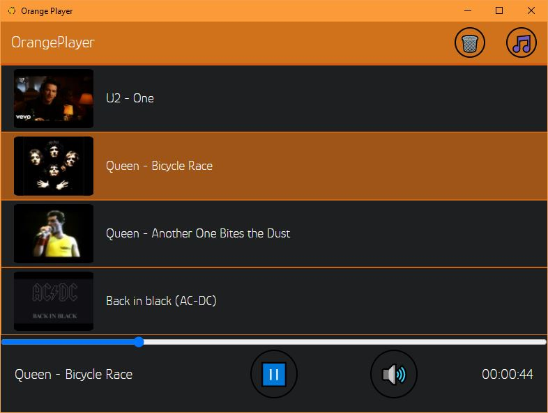

# OrangePlayer 🍊

Super Simple music player with download functionality built in,
built using Vue.js and electron.

## Functionality:

- Stores songs and thumbnails locally
- Download songs from youtube by using the video link
- Download songs from soundcloud using the track url

## Screenshots:


## Project setup
```
npm install
```

### Builds and starts electron app
```
npm run start
```

### Compiles electron app to windows exe
```
npm run package
```
